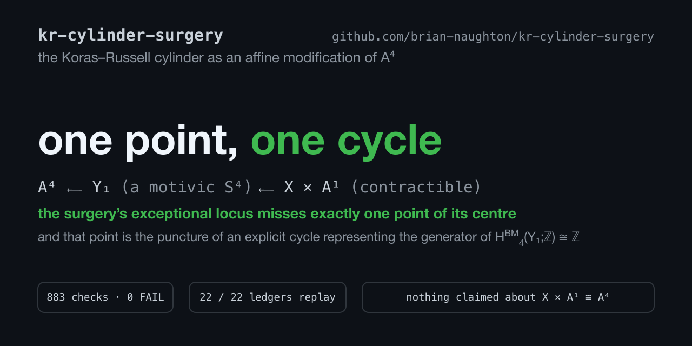

[](https://doi.org/10.5281/zenodo.21745579)

# The Koras–Russell cylinder as an affine modification of 𝔸⁴

**A commuting square through a motivic 4-sphere, and a one-point Borel–Moore
defect.**

Paper: [`kr-cylinder-surgery.pdf`](kr-cylinder-surgery.pdf) (source
[`main.tex`](main.tex), compiled with Tectonic).
Verify every computational claim: [`./verify.sh`](verify.sh).

---

## What this is

Let X = V(x²y + z² + x + t³) ⊂ 𝔸⁴ be the Koras–Russell cubic threefold. In
2009, Dubouloz, Moser-Jauslin and Poloni ([arXiv:0903.4278](https://arxiv.org/abs/0903.4278), §7)
wrote down an explicit locally nilpotent derivation ∂ on ℂ[X × 𝔸¹] whose
kernel does not contain x — the witness that the Makar-Limanov invariant dies
on the cylinder.

This repository takes that published action as a starting datum and works out
the geometry underneath it. The result is a single connected picture:

```
𝔸⁴  ⟵σ₃—  Y₁  (a motivic S⁴)  ⟵σ₄—  X × 𝔸¹  (𝔸¹-contractible)
```

every arrow an affine modification — and an account, at integral Borel–Moore
level, of how the middle term's 4-sphere is created by one arrow and destroyed
by the other.

## The results at a glance

**The action, dissected** (§3 of the paper)

- ker ∂ = ℂ[p, q, t], a polynomial ring in three variables.
- ∂ has **no slice** — exact, no degree bound: it degenerates along a line.
- The plinth ideal is **not principal**; the known subideal (p+1)(t³, q) it
  contains already **encloses** its zero locus in V(p+1) ∪ V(t,q). That locus
  is non-empty. The divisorial/codimension-two asymmetry between the two
  components is a statement about the subideal — the exact plinth is not
  determined, and no claim is made about which component survives in V(pl).
- The quotient morphism X × 𝔸¹ → 𝔸³ is neither surjective nor
  equidimensional, for one certified reason: qZ + p + p² + t³(y + w²) = 0.
- **A[w][1/(t(p+1))] = ℂ[p,q,t][1/(t(p+1))][Z]** — after inverting one
  explicit function, the cylinder *is* a trivial 𝔸¹-bundle over 𝔸³.

**The modification** (§§4–5)

- ℂ[X × 𝔸¹] = ℂ⁽⁴⁾[I/F] with F = t³(p+1) and an explicit four-generator
  canonical centre.
- One component of the centre is **singular along a line**, so the centre
  cannot be carried to any smooth one by an automorphism of 𝔸⁴ — an
  obstruction with no degree bound.
- The two steps **commute**. One order runs through the singular X₁ × 𝔸¹
  (and X₁ × 𝔸ᵏ ≇ 𝔸³⁺ᵏ for every k ≥ 0); the other through the **smooth**
  Y₁ = V(t³H − p − p² − qZ) ⊂ 𝔸⁵, whose defining equation is the governing
  identity above, rewritten.

**The smooth middle** (§6)

- Y₁ is the member Q₍₃,₁₎, z²−¼ of the Asok–Dubouloz–Østvær family
  ([arXiv:2112.08241](https://arxiv.org/abs/2112.08241), Ex. 4.2.5) — so its
  smoothness and its 𝔸¹-homotopy type ℙ¹∧ℙ¹, complex realisation S⁴, are
  theirs. Independently, [Y₁] = 𝕃⁴ + 𝕃² gives χ_c = 2, hence
  Y₁ × 𝔸ʳ ≇ 𝔸⁴⁺ʳ for every r ≥ 0.

**The ledger, and the defect** (§7)

- The singular route is K₀-neutral at each step; the smooth route creates an
  𝕃² packet at the t-arrow and removes it at the (p+1)-arrow.
- Every stratum is Hodge–Tate, so Hodge–Deligne polynomials add nothing beyond
  the classes — but they do pin the packet as a Tate class of weight 4 and
  type (2,2), matching the reduced motive of ℙ¹∧ℙ¹.
- The entire Euler difference is χ_c(D₄) − χ_c(E₄) = 1, and χ_c(E₄) = 0 for
  exactly one reason: **the exceptional locus is empty over precisely one
  point of its centre**, (p,q,t,Z,H) = (−1,0,0,0,0).

**The final theorem** (§8)

> H^BM₄(Y₁;ℤ) ≅ ℤ, generated by the fundamental class of **either** component
> of the doubled fibre over the origin of 𝔸²_{t,q}, with [F₀] = −[F₋₁]. The
> generator is **supported on the modification divisor** — it has the
> representative F₋₁ contained in it — and restricts to zero on the common
> open. Its inverse image σ₄⁻¹(F₋₁) is 𝔾_m × 𝔸¹, the same plane with the fibre
> over the defect point (−1,0,0,0,0) deleted, and the fundamental class of
> that locus, pushed forward along its **closed immersion**, is zero in
> H^BM₄(X × 𝔸¹) = 0. Dually, and with no properness hypothesis,
> σ₄\* PD[F₋₁] = 0 in H⁴(X × 𝔸¹;ℤ).

So the exceptional defect does not merely account for the Euler and
Grothendieck-class change: it locates the cycle-level content of that change
at one named point, which is the puncture of an explicit cycle representing
the generator.

**What is deliberately not claimed.** σ₄ is *not proper* — we prove that — so
there is no Borel–Moore pushforward along it, and nothing is transported along
σ₄ in homology. The vanishing of H^BM₄(X × 𝔸¹) needs nothing motivic: X × 𝔸¹
is a smooth fourfold and topologically contractible, so duality gives it
directly. The 𝔸¹-contractibility results of Dubouloz–Fasel and
Hoyois–Krishna–Østvær (whose theorem is for *finite suspensions*) are context,
not inputs. And deriving the vanishing from the modification geometry alone
would need the Borel–Moore homology of the modified punctured family, which is
not computed here.

## Verify it yourself

```bash
./verify.sh
```

Builds a fresh virtual environment, runs the two standing environment gates
and all 22 certificate runners in a scratch directory, replays each freshly
produced ledger against the frozen certificate shipped in `runs_synthesis/`,
and checks the tallies. Expected: **883 checks, 713 PASS, 0 FAIL, 22/22
ledgers replay identically.** Runtime is about 11 minutes end to end — some
6.5 minutes of runners plus building the environment — and roughly 70% of the
runner time is a single runner (`rg_1_diagnostics`, ~4.5 minutes). If it looks
like it has hung, that is where it is, and it is working. Everything else
finishes in seconds. See [`VERIFY.md`](VERIFY.md) for the measured per-runner timings,
what the check classes mean, and how to read a ledger.

## Scope — what is *not* claimed

Stated plainly, because it matters:

- **Nothing here bears on whether X × 𝔸¹ ≅ 𝔸⁴, or X × 𝔸² ≅ 𝔸⁵.** Both remain
  exactly as open as before. The dissection results are properties of the
  *action*, not separating invariants of the space.
- **Y₁ is not a new variety.** It is a member of a published family, and its
  smoothness and homotopy type are Asok–Dubouloz–Østvær's, cited at every use.
  What appears to be new is its *role*: the smooth intermediate completion of
  a commuting affine-modification square attached to the Koras–Russell
  cylinder.
- Several statements are outcomes of searches at **declared, bounded caps**.
  Those are recorded as measurements of what was searched, never as negative
  results, and are marked as such wherever they appear.
- The paper is positioned as *a concrete singular-defect instance of the
  established cofiber mechanism for affine modifications* — the mechanism
  itself is published.

## Two errata in the source paper

Machine-verifying the starting datum against its own printed identities turned
up two slips in [arXiv:0903.4278](https://arxiv.org/abs/0903.4278), **both
harmless to that paper's conclusions**, recorded in §2 so that anyone who
recomputes finds the same thing:

1. Prop. 7.1's sixth composition identity prints Φ∘Ψ(w) = w − (1/t³)P; the
   verified value is w − (w/t³)P. Both are ≡ w mod (P), so the proposition is
   unaffected. A typographical slip.
2. Cor. 7.3 states Ker(∂₁) ∩ Ker(∂₂) = ℂ[x] for the derivations on A[w], but
   w lies in both kernels. The classical statement is on A; on A[w] one
   adjoins ∂/∂w, which the paper's own framework supplies. ML(A[w]) = ℂ
   stands.

## Credit

- The starting datum — the conjugacy Φ/Ψ, the derivation ∂, the elements
  p, q, Z, the auxiliary threefold X₁, and the t-localised bridge — is
  **Adrien Dubouloz, Lucy Moser-Jauslin and Pierre-Marie Poloni**'s
  ([arXiv:0903.4278](https://arxiv.org/abs/0903.4278)). No novelty is claimed
  for any of it. Their explicit computations are what made this possible.
- The family Q_{m,P}, its smoothness criterion, its 𝔸¹-homotopy type, and the
  open classification Question 4.2.6 are **Aravind Asok, Adrien Dubouloz and
  Paul Arne Østvær**'s ([arXiv:2112.08241](https://arxiv.org/abs/2112.08241)).
  None of it is reproved here.
- The final theorem's ambient vanishing uses only the **classical topological
  contractibility** of X together with duality — nothing motivic. The
  𝔸¹-contractibility results of **Adrien Dubouloz and Jean Fasel**
  ([arXiv:1512.01933](https://arxiv.org/abs/1512.01933)), extending **Marc
  Hoyois, Amalendu Krishna and Paul Arne Østvær**
  ([arXiv:1409.1293](https://arxiv.org/abs/1409.1293), whose theorem is for
  *finite suspensions*), set the context for this circle of questions and are
  gratefully acknowledged, but no statement of theirs is used here.
- Affine modifications follow **Kaliman–Zaidenberg**
  ([math/9801076](https://arxiv.org/abs/math/9801076)); the hypothesis grid in
  §3 is **Masuda**'s ([arXiv:2512.06687](https://arxiv.org/abs/2512.06687));
  the plinth-support reading is **Shakhmatov**'s
  ([arXiv:2605.00138](https://arxiv.org/abs/2605.00138)).
- This repository: Brian Naughton, working with Claude Fable 5 and Claude
  Opus 5 (Anthropic) as described in the paper's Methods appendix. Four rounds
  of adversarial review by GPT-5.6 Sol (OpenAI) shaped the prior-art
  demarcation, the terminology, and the question the last section answers; one
  of its inferences was overturned by the computation, and the corrected
  statement is Theorem 8.4.

Corrections and prior-art pointers are very welcome. If any statement here has
appeared earlier elsewhere, tell us and it will be cited prominently.

## Citing

Archived on Zenodo: **[10.5281/zenodo.21745579](https://doi.org/10.5281/zenodo.21745579)**
— that is the concept DOI and always resolves to the latest version; the v1.0
release is [10.5281/zenodo.21745580](https://doi.org/10.5281/zenodo.21745580).
Machine-readable metadata is in [`CITATION.cff`](CITATION.cff).

## Licence

MIT — see [`LICENSE`](LICENSE).

## Contact

Brian Naughton, independent researcher — <naughtonb@proton.me> · ORCID
[0009-0008-3404-610X](https://orcid.org/0009-0008-3404-610X).
Issues and pull requests are welcome, and so is email — corrections,
prior-art pointers and referee-style objections especially.
